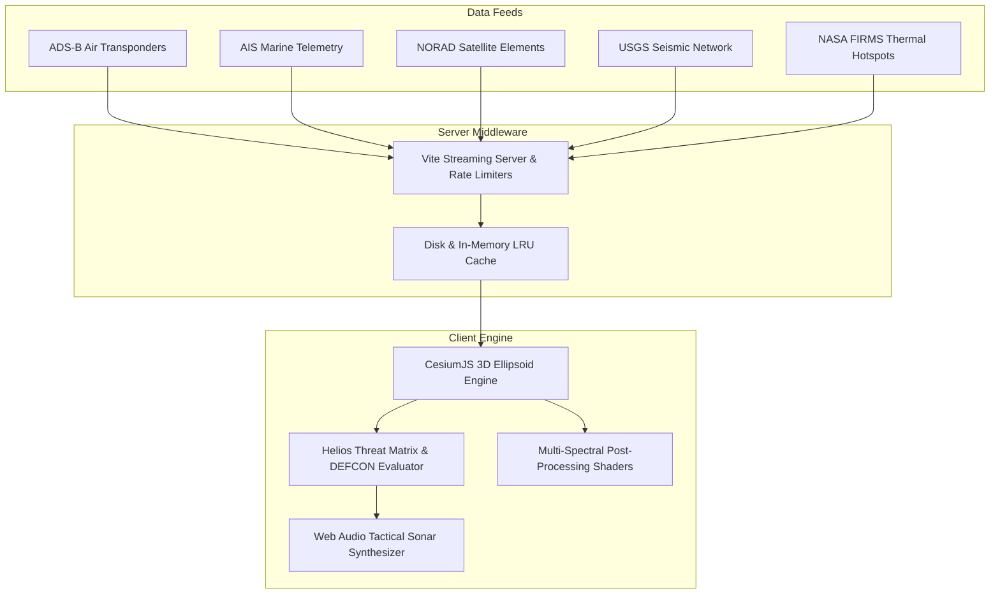

# 🌐 HELIOS C2

<div align="center">


**Planetary Multi-Domain Situational Awareness & Tactical C4ISR Defense Platform**

*Real-time 3D planetary intelligence, multi-spectral sensor shaders, orbital conjunction physics, acoustic sonar telemetry, and autonomous DEFCON threat evaluation.*

[Live Telemetry](#-multi-domain-telemetry-engine) • [Tactical HUD](#-tactical-hud--sensor-shaders) • [Architecture](#-system-architecture) • [Quick Start](#-quick-start)

</div>

---

## 🛰️ Executive Overview

**Helios C2** is an aerospace-grade Command & Control (C2) situational awareness platform operating directly inside the browser. It fuses distributed, high-throughput planetary telemetry streams into a synchronized photorealistic 3D WGS84 ellipsoid.

By unifying air, space, maritime, and seismic sensor networks into a single operational picture, Helios C2 enables defense operators, researchers, and OSINT analysts to track global movements, calculate orbital conjunction risks, detect transponder anomalies, and monitor environmental crises at 60 FPS without commercial per-seat licensing.

---

## ⚡ Core Operational Capabilities

```
+-------------------------------------------------------------------------+
|                              HELIOS C2                                  |
|         Multi-Domain Command & Control Planetary Architecture           |
+-------------------------------------------------------------------------+
                                     |
    +-----------------+--------------+---------------+----------------+
    |                 |                              |                |
    v                 v                              v                v
[AIR DOMAIN]    [SPACE DOMAIN]               [MARITIME DOMAIN]   [CRISIS MATRIX]
ADS-B Telemetry  CelesTrak GP Orbitals        AIS Vessel Feeds    USGS Seismic
Altitude Gates   NORAD SGP4 Propagation       Dark Vessel Detect  NASA FIRMS
Velocity Vectors Conjunction Risk Detection   Strait Chokepoints  Thermal Hotspots
```

### 1. ✈️ Air Domain Telemetry (ADS-B Transponders)
- **Live Flight Tracking**: Ingests real-time ADS-B transponder telemetry, rendering global civilian, commercial, and strategic military aircraft.
- **Flight Stratigraphy**: Displays altitude, true airspeed (TAS), climb/descent rate, and projected heading tapes.
- **Cockpit Chase Mode**: First-person pilot HUD and 3D chase camera tracking target aircraft over photorealistic terrain.

### 2. 🛰️ Space Domain (CelesTrak Orbital Propagation)
- **SGP4 Orbital Engine**: Real-time position calculation for thousands of active satellites, space stations (ISS, Tiangong), and trackable orbital debris.
- **Conjunction Watch**: Monitors satellite orbit intersections and alerts on close orbital passes.

### 3. 🚢 Maritime Domain (AIS Vessel Tracking)
- **Global Marine Routes**: Tracks commercial tankers, bulk carriers, container ships, and naval vessels across vital maritime chokepoints (Suez, Malacca, Panama, Hormuz).
- **Dark Vessel Heuristics**: Automatically flags anomalous transponder dropouts and unexpected speed/trajectory deviations.

### 4. 🌋 Crisis & Environmental Matrix
- **USGS Seismic Grid**: Triangulates real-time earthquake epicenters, depth, and Richter magnitude with animated seismic wave rings.
- **NASA FIRMS Thermal Anomalies**: Near-real-time satellite thermal infrared detections highlighting active wildfires and industrial heat signatures.

### 5. 🎯 Tactical HUD & Multi-Spectral Shaders
- **FLIR Thermal Spectrum**: Simulates forward-looking infrared sensor views for target acquisition against terrain heat signatures.
- **NVG Green Phosphor**: Intensified low-light night-vision tube simulation with peripheral vignette.
- **CRT Phosphor Scanlines**: Curved tactical CRT monitor emulation with vintage raster scanlines.
- **Cyber Sonar & Acoustic Engine**: Synthesizes periodic acoustic naval sonar pings (880 Hz decaying sine wave) and military radio squelch bursts via the Web Audio API.

### 6. 🛡️ DEFCON Threat Matrix Engine
- Real-time threat evaluation ticker scoring active contacts and assigning dynamic operational readiness states (DEFCON 5 through DEFCON 1).

---

## 🛠️ System Architecture



---

## 🚀 Quick Start

### Prerequisites
- Node.js 24+ (recommended) or 22+
- npm or pnpm

### Installation
```bash
# Clone the repository
git clone https://github.com/freshstart2066-create/heliosc2.git

# Navigate into project directory
cd heliosc2

# Install dependencies
npm install

# Start the local tactical console
npm run dev
```

The application boots on keyless satellite imagery and open elevation models out of the box. Open `http://localhost:4173` or the port displayed in your terminal.

### Production Build
```bash
npm run build
npm run preview
```

---

## ⚙️ Configuration & Optional Credentials

Helios C2 works with zero API keys required. Optional credentials can be placed in a `.env` file to unlock enhanced resolution layers:

```env
# Optional: Google Photorealistic 3D Tiles & Places
GOOGLE_MAPS_API_KEY=your_key_here

# Optional: Cesium ion Token (for Ion asset hosting)
CESIUM_ION_TOKEN=your_token_here

# Optional: Realtime Voice Control
OPENAI_API_KEY=your_openai_key_here
```

---

## 📜 License & Compliance

Distributed under the **MIT License**. See `LICENSE` for details. Telemetry datasets fetched at runtime are governed by their respective public data policies (USGS, NASA, CelesTrak, OpenSky Network).
